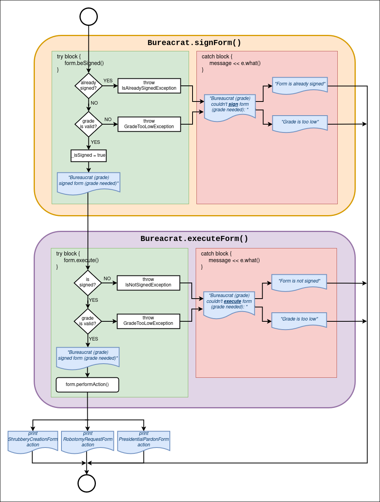

# Exercise 02: No, you need form 28B, not 28C...

In this exercise, the abstract base class (AForm) ensures that all forms (*ShrubberyCreationForm*, *RobotomyRequestForm*, and *PresidentialPardonForm*) implement the execute method. This provides a clear contract that any concrete form must follow, thus enabling polymorphism and ensuring consistency in how forms are handled.

## Base class

Creating a base class and then deriving multiple classes from it promotes code reusability and organization:

* Common Functionality: AForm contains common attributes and behaviors (like *_name*, *_isSigned*, *_gradeToSign*, *_gradeToExecute*, methods to sign the form, etc.) that all forms will share. This avoids code duplication.

* Polymorphism: By using a base class pointer or reference, you can handle different types of forms uniformly. For instance, a *Bureaucrat* can sign or execute any form without needing to know the specific type of the form.

## Abstract class

An abstract class is a class that cannot be instantiated on its own and is designed to be a base class for other classes. It usually contains one or more pure virtual functions (methods that have no implementation in the abstract class and must be implemented by derived classes).

Why Use an Abstract Class?

* Enforcement: By making AForm abstract, you enforce that any derived class must implement specific methods, ensuring that each derived class has its own specific behavior while sharing common functionality.

* Polymorphism: Abstract classes allow you to define a common interface for all derived classes, enabling polymorphic behavior. This is useful in scenarios where you want to treat different derived classes uniformly.


The subject requires to add a 
```execute(Bureaucrat const & executor) const``` 
member function to the base form and implement a function to execute the form’s action of the concrete classes. **By adding this function as pure virtual we will make the Form class abstract.**

<h2>Pseudocode flow chart</h2>
<p align="center">
	
</p>