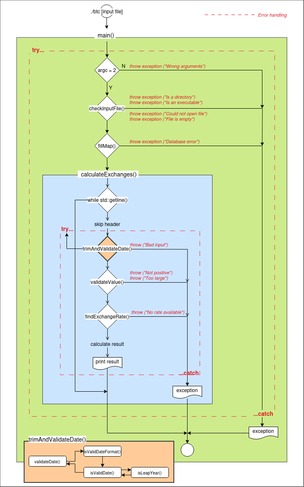

# Exercise 00: Bitcoin Exchange
## Target
Write a program that calculates and outputs the value of a certain amount of bitcoin on a certain date. It must take as a parameter an input file containing a list of dates and the amount of bitcoins corresponding each date. To calculate the results, the program will use a database in csv format -provided with this subject- which represents bitcoin price over time. This database is provided with this subject.
- Each line in the input file must use the following format: "date | value".
- Dates must follow the format: *Year-Month-Day*.
- Values must be either a float or a positive integer, between 0 and 1000.
- You must use at least one container in your code.
> [!WARNING]
> Be aware that the type of container(s) you choose for this exercise **will no longer be usable for the rest of this module!**
-----------------------------------
## Flow chart

	

